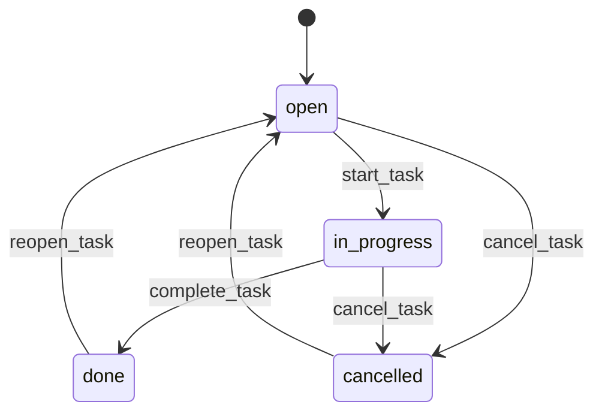

These four tools move a task through its lifecycle by changing its `status` field. Unlike `update_task`, each transition tool records a `task_history` entry so the full audit trail is preserved. Use `get_task` with `include_history: true` to inspect the complete change log.

## Status transitions

| From | To | Tool |
|---|---|---|
| `open` | `in_progress` | `start_task` |
| `in_progress` | `done` | `complete_task` |
| `open` or `in_progress` | `cancelled` | `cancel_task` |
| `done` or `cancelled` | `open` | `reopen_task` |

## Tools

### `start_task`

Set a task's status to `in_progress`. Use this when work on the task has begun.

<ParamField body="project_id" type="string">
  Project containing the task. Defaults to the project for the current working directory.
</ParamField>

<ParamField body="task_id" type="string" required>
  ULID of the task to start.
</ParamField>

---

### `complete_task`

Mark a task as `done`. Optionally record how long the work actually took.

<ParamField body="project_id" type="string">
  Project containing the task. Defaults to the project for the current working directory.
</ParamField>

<ParamField body="task_id" type="string" required>
  ULID of the task to complete.
</ParamField>

<ParamField body="actual" type="string">
  Actual time spent, in any human-readable format (e.g. `"3h"`, `"1.5 days"`). Stored in the `actual` field on the task and useful for comparing against the original `estimate`.
</ParamField>

---

### `cancel_task`

Cancel a task without completing it. The task moves to `cancelled` status. Cancelled tasks can be reopened with `reopen_task`.

<ParamField body="project_id" type="string">
  Project containing the task. Defaults to the project for the current working directory.
</ParamField>

<ParamField body="task_id" type="string" required>
  ULID of the task to cancel.
</ParamField>

---

### `reopen_task`

Reopen a task that is `done` or `cancelled`, setting its status back to `open`. Use this when completed work needs revisiting or a cancelled task becomes relevant again.

<ParamField body="project_id" type="string">
  Project containing the task. Defaults to the project for the current working directory.
</ParamField>

<ParamField body="task_id" type="string" required>
  ULID of the task to reopen.
</ParamField>

---

## Change history

Every call to a lifecycle tool writes a row to `task_history` capturing:

- The field that changed (`status`)
- The old and new values
- A timestamp
- The actor (`changed_by`): `"local"` for stdio connections, or the authenticated username for self-hosted deployments

To read the history for a task, call `get_task` with `include_history: true`.

<Note>
  Some transitions are enforced. `start_task` throws if the task is already `done` or `cancelled`. `complete_task` throws if the task is `cancelled`. `cancel_task` throws if the task is already `cancelled`. `reopen_task` always succeeds regardless of current status.
</Note>
